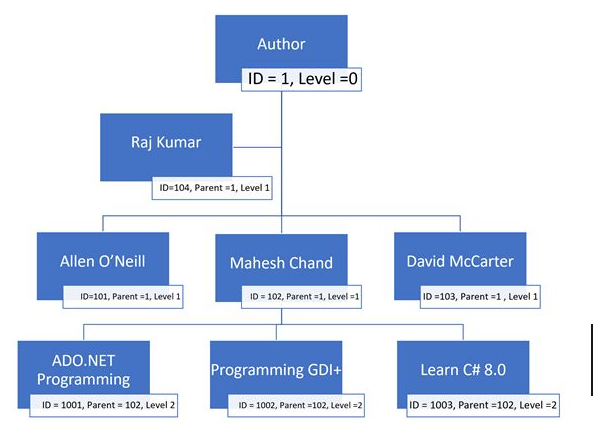
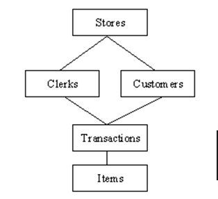
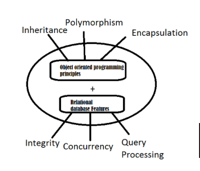
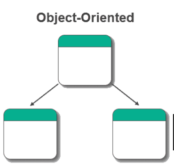
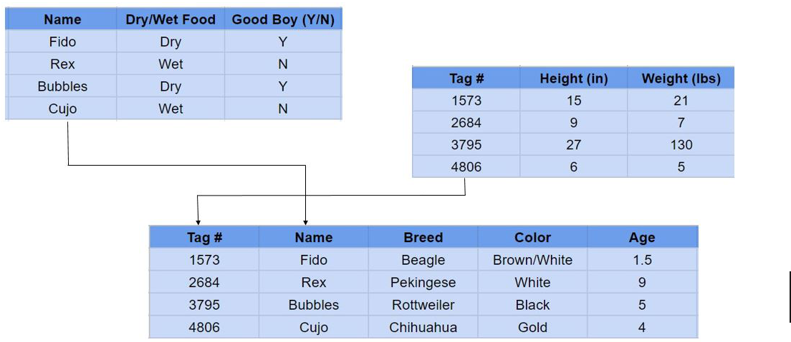
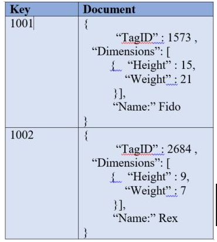

# Database

---

#### Data can be defined as crude and unordered facts that need to be processed to make it organized and understood. The collection of data serves various purposes.  Although data can be present everywhere in our daily life, it is our responsibility how to collect the data from the different corners and then process the data to get some useful insight from it which can be useful for our particular use. It can be anything it can be in the form of symbols, characters, numbers, images, etc. It is always interpreted by humans or machines to make it organized in particular order to derive its meaning. It could be collected from a different sources including applications, questionaires, forms etc and are stored in tables or arranged in ways where they could be easily accessed, arranged and edited (insertion and deletion) if needed/required. Database is a collection of logically inter-related data which helps in efficient retrieval, insertion and deletion of data from database and organizes the data in the form of tables, views, schemas etc. 

## Types of Databases

---

### The various types of databases includes: 

* #### Hierarchical databases: A hierarchical database is a data model in which data is stored in the form of records and organized into a tree-like structure, or parent-child structure, in which one parent node can have many child nodes connected through links. It is used primarily today for storing geographic information and file systems. Example is  IBM Information Management System (IMS). A real world application is Windows Registry. The following tree diagram represents above tabular data into a hierarchical form with their parent and level: 

* #### Network databases: It is based on a network data model, which allows each record to be related to multiple primary records and multiple secondary records. It allows users to create a flexible model of relationships between entities. The network model was proposed in 1969 by Charles Bachman, as an extension of the hierarchical database model. It can be represented as a graph instead of a tree structure. The graph is defined by a schema, which is a list of data nodes and the relationships between them. This provides a data structure which, in a regular relational database, can only be accessed by inference. It provides a lot of flexibility, but are still limited to access patterns and design limitations of hierarchical databases. These limitations were later overcome by relational database management systems. An example is Raima Database Manager. An example of Network Database:
  

* ####  Object-oriented databases: An object database is managed by an object-oriented database management system (OODBMS). The database combines object-oriented programming concepts with relational database principles. It has an object-oriented data model with classes, properties, and methods. Object databases are commonly used in applications that require high performance, calculations, and faster results. Example of Object Oriented Database are IBM Db2, InterSystems IRIS, Google Cloud Storage for Firebase etc. Below is an illustration for OODB:
     

* #### Relational Database: It uses a structure that allows us to identify and access data in relation to another piece of data in the database. Often, data in a relational database is organized into tables. The relationship between each data point is clear and searching through those relationships is relatively easy. The relationship between tables and field types is called a schema. For relational databases, the schema must be clearly defined. A good example of relational databse is SQL. Below is an illustration of relational database:
    

* #### Non-Relational Databases: A non-relational database is any database that does not use the tabular schema of rows and columns like in relational databases. Rather, its storage model is optimized for the type of data it’s storing. Non-relational databases are also known as NoSQL databases which stands for “Not Only SQL.” Where relational databases only use SQL, non-relational databases can use other types of query language. An example is MongoDB. 
    